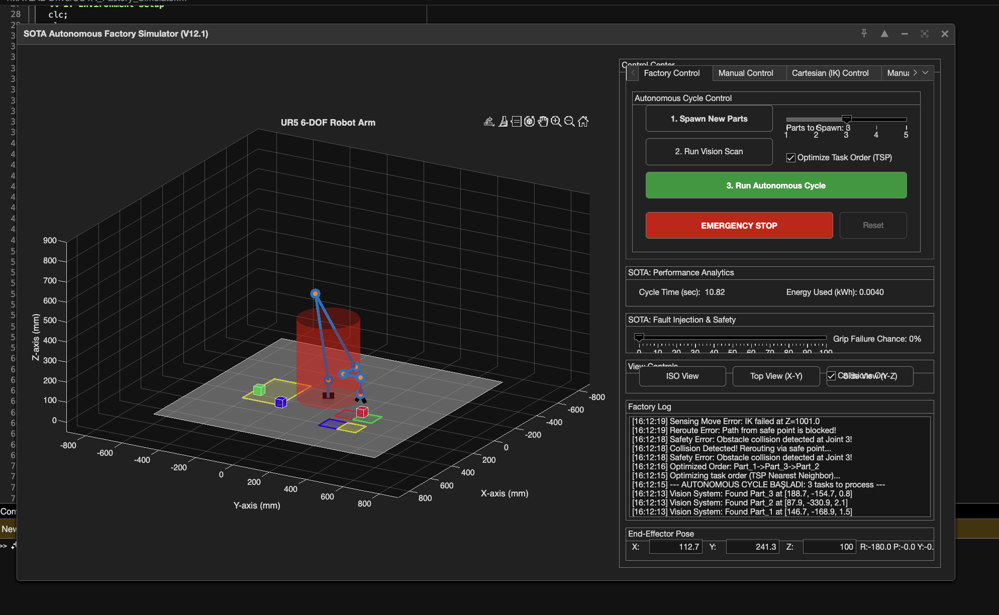

# SOTA Autonomous Factory Simulator (UR5)

This MATLAB project is a high-fidelity "Digital Twin" of a state-of-the-art autonomous factory work cell. It simulates a 6-DOF Universal Robots (UR5) arm performing a complex, multi-part, multi-destination pick-and-place task.

This "super simulation" moves beyond simple animation and models the advanced, intelligent, and resilient systems found in a modern autonomous factory. It is built on a robust, timer-based animation engine for smooth and reliable visuals.

**Core SOTA concepts modeled:**

- Intelligent Task Planning (TSP Optimization)
- Machine Perception (Simulated Vision System)
- Dynamic Collision Avoidance (Obstacle & Table)
- Runtime Fault Recovery (Grip Failures & Retries)
- Digital Twin Analytics (Cycle Time & Energy)

  


## SOTA (State-of-the-Art) Features Explained

This simulation models a truly "smart" factory by integrating the following systems:

### Autonomous Task Queue
Spawn multiple parts (1-5) with randomized pick-and-place locations. The simulator generates a full task queue (a list of structs) for the robot to process.

### TSP Task Optimization
When the "Optimize Task Order" checkbox is active, the robot runs a Traveling Salesperson (TSP) algorithm (using a greedy Nearest Neighbor approach) to find the most efficient, time-saving path to visit all parts, minimizing total travel distance. You can uncheck this to see the (less efficient) "as-scanned" order.

### Simulated Machine Vision
The robot must first "see" the parts. The "Run Vision Scan" button simulates a perception system, drawing cyan "detection boxes" over the parts. This step intentionally adds small (+/- 2.5mm) noise to the part coordinates, forcing the robot to rely on its sensor-based moves.

### Runtime Fault & Recovery
The "Grip Failure Chance" slider injects real-time errors. If a grip fails (based on a random roll), the robot won't just stop. It will dynamically re-plan a "retry" move (move up, move down, grip again). It will attempt this up to 3 times before logging a "CRITICAL FAILURE" and moving on to the next part, preventing a single failure from stopping the entire line.

### Dynamic Collision Avoidance
A central "Safety Obstacle" and the "Table" are registered as collision objects. Before executing any move, the robot performs a pre-flight check. If a direct path would collide (e.g., cut through the obstacle or crash into the table), the log will report "Collision Detected! Rerouting..." and the robot will automatically plan a safe, multi-step path (e.g., move "up and over") to avoid it.

### High-Fidelity Animation Engine
All motion is driven by a single, high-framerate timer (30 FPS). This "game loop" processes a central queue of command structs. This architecture replaces all pause commands, guaranteeing perfectly smooth, clear, and reliable animations for every action, from robot motion to the smoothly interpolating gripper.

### Sensor-Based Moves
The robot simulates a force-torque sensor by performing slow, "sensing" moves for the final pick/place actions. This is visualized by a red sensor cone appearing from the end-effector, providing clear feedback that the robot is in a high-precision mode.

### Digital Twin Analytics
After an autonomous cycle, the "Performance Analytics" panel displays the Total Cycle Time (sec) and simulated Total Energy Used (kWh). This allows you to run experiments and quantify the exact time and energy savings of enabling "Task Optimization."

### True E-Stop System
The "EMERGENCY STOP" button will immediately interrupt any robot motion (even mid-animation) and lock all controls. The simulation remains frozen until the "Reset" button is pressed, mimicking a real-world safety-rated system.

## Standard Features

### Full 3-Tab GUI

- **Factory Control**: Spawn parts, run vision, and start the autonomous cycle.
- **Manual Control**: 6 sliders for live, timer-based joint control.
- **Cartesian (IK) Control**: Move the robot by typing in a target (X, Y, Z, Roll, Pitch, Yaw) pose.

### Manual Path Teaching
A "Manual Programming" tab allows you to save the robot's current pose to a list. You can then click "Run Saved Path" to have the robot execute your custom, collision-checked sequence.

### Live Factory Log
All actions, plans, sensor readings, and errors are reported to a central log with timestamps, giving you a complete trace of the robot's "thoughts" and decisions.

### View Controls
Dedicated buttons to snap the 3D-axis to Isometric (ISO), Top (X-Y), and Side (Y-Z) views.
```
.
│
├── SOTA_Factory_Simulator.m   (The main app you run)
│
├── README.md                  (This file)
│
└── functions/               (Folder for all library files)
    ├── compute_fk.m           (Forward Kinematics: angles -> position)
    ├── define_ur5_robot.m     (D-H Parameters for UR5)
    ├── dh_transform.m         (Core D-H function)
    ├── generate_trajectory.m  (Smooth (Quintic) Trajectory Planner)
    ├── plotcube.m             (Utility for drawing parts/obstacles)
    ├── rpy_to_tform.m         (Roll, Pitch, Yaw -> 4x4 Matrix)
    ├── solve_ur5_ik.m         (Analytical Inverse Kinematics: position -> angles)
    └── tform_to_rpy.m         (4x4 Matrix -> Roll, Pitch, Yaw)
```
## How to Run

1. Ensure you have MATLAB (R2019b or newer) and (ideally) the Robotics System Toolbox.
2. Create a folder named `functions/`.
3. Place all 8 helper files (`compute_fk.m`, `define_ur5_robot.m`, etc.) inside the `functions/` folder.
4. Place `SOTA_Factory_Simulator.m` in the main folder (one level above `functions/`).
5. Run `SOTA_Factory_Simulator.m`.

## Recommended Workflow (Autonomous Cycle)

1. Run the `SOTA_Factory_Simulator.m` file.
2. On the **Factory Control** tab, select the number of parts to spawn (e.g., 4).
3. Click **"1. Spawn New Parts"**. You will see the parts appear in the yellow "Pick Zone."
4. Click **"2. Run Vision Scan"**. You will see the "detections" (cyan boxes) appear over the parts.
5. Check (or uncheck) the **"Optimize Task Order (TSP)"** box.
6. Set the **"Grip Failure Chance"** slider (e.g., 20% to see it in action).
7. Click **"3. Run Autonomous Cycle"**.
8. The controls will lock, and the robot will begin processing the full, optimized queue.
9. Watch the **Factory Log** to see the robot's "thoughts," including collision checks, grip failures, and retries.
10. When finished, review the **Performance Analytics** panel to see the total time and energy used.

## License

This project is licensed under the MIT License.


